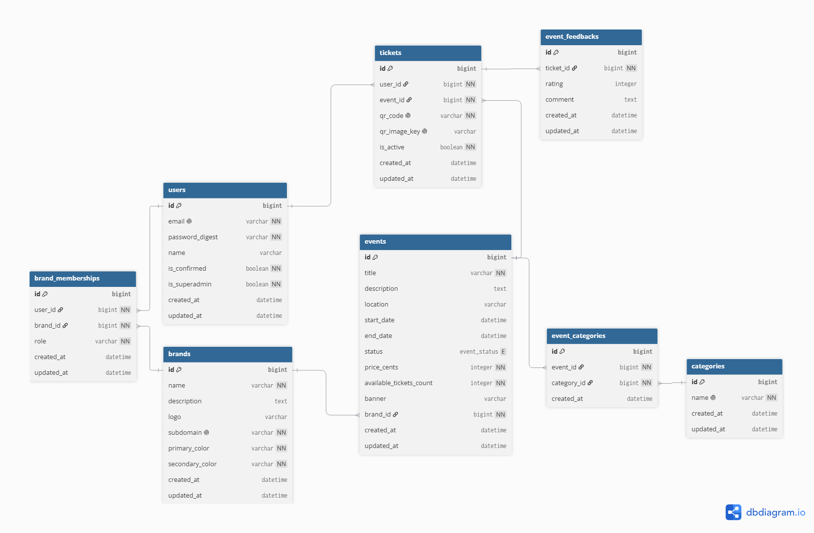

# EventifyMTEP (Rails API)

Eventify — Multi-Tenant Event Platform

## DB

Use DBML to define your database structure

Docs: https://dbml.dbdiagram.io/docs

Diagram: https://dbdiagram.io/d



```
// ==========================================
// ENUMS
// ==========================================

Enum event_status {
  draft
  draft_on_review
  published
  rejected
  published_unverified
  published_on_review
  published_rejected
  archived
  cancelled
}

// ==========================================
// CORE TABLES
// ==========================================

Table Users {
  id integer [primary key]
  name varchar
  email varchar [unique, not null]
  password_digest varchar [not null]
  is_superadmin boolean [default: false]
  created_at timestamp
}

Table Brands {
  id integer [primary key]
  name varchar [not null]
  subdomain varchar [unique, not null]
  description text
  logo_url varchar
  primary_color varchar [not null, default: '#000000']
  secondary_color varchar [not null, default: '#FFFFFF']
  created_at timestamp
}

Table Categories {
  id integer [primary key]
  name varchar [unique, not null]
}

// ==========================================
// DEPENDENCY TABLES (Tier 2 & 3)
// ==========================================

Table Brandbrand_memberships {
  id integer [primary key]
  user_id integer [ref: > Users.id, not null]
  brand_id integer [ref: > Brands.id, not null]
  role varchar [not null, note: "'owner', 'manager', 'user'"]
  created_at timestamp

  indexes {
    (user_id, brand_id) [unique, name: 'index_brand_memberships_on_user_and_brand']
  }
}

Table Events {
  id integer [primary key]
  title varchar [not null]
  description text
  brand_id integer [ref: > Brands.id, not null]
  location varchar
  start_date timestamp
  end_date timestamp
  status event_status [default: 'draft']
  created_at timestamp
}

Table EventCategories {
  id integer [primary key]
  event_id integer [ref: > Events.id, not null]
  category_id integer [ref: > Categories.id, not null]

  indexes {
    (event_id, category_id) [unique, name: 'index_event_categories_on_event_and_category']
  }
}

// ==========================================
// TICKET & FEEDBACK ISOLATION
// ==========================================

Table Tickets {
  id integer [primary key]
  user_id integer [ref: > Users.id, not null]
  event_id integer [ref: > Events.id, not null]
  qr_code varchar [unique, not null]
  is_active boolean [default: true]
  created_at timestamp
}

Table EventFeedback {
  id integer [primary key]
  ticket_id integer [ref: - Tickets.id, not null] // One-to-one relationship (1 ticket = 1 review)
  rating integer [note: "Range: 1-5"]
  comment text
  created_at timestamp
}
```

## API Documentation

Interactive Swagger UI is available at `/api-docs`.

| Environment | URL                            |
| ----------- | ------------------------------ |
| Local       | http://localhost:3000/api-docs |

### Endpoints

| Method | Path                       | Description         |
| ------ | -------------------------- | ------------------- |
| POST   | /auth/register             | Register (Sprint 2) |
| POST   | /auth/login                | Login (Sprint 2)    |
| GET    | /api/v1/events             | List events         |
| POST   | /api/v1/events             | Create event        |
| GET    | /api/v1/events/:id         | Show event          |
| GET    | /api/v1/brands             | List brands         |
| POST   | /api/v1/brands             | Create brand        |
| GET    | /api/v1/brands/:id         | Show brand          |
| GET    | /api/v1/categories         | List categories     |
| POST   | /api/v1/categories         | Create category     |
| PATCH  | /api/v1/tickets/:id/review | Leave review        |

### Update docs after changes

```bash
cd api
RAILS_ENV=test bundle exec rake rswag:specs:swaggerize
```
